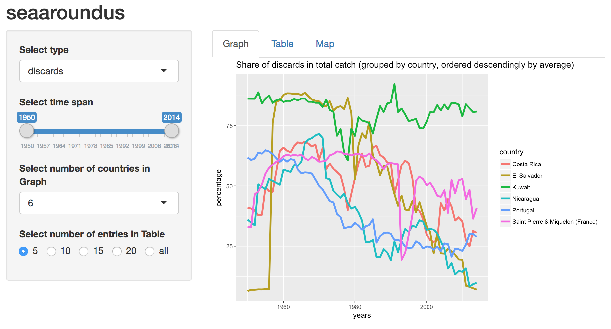
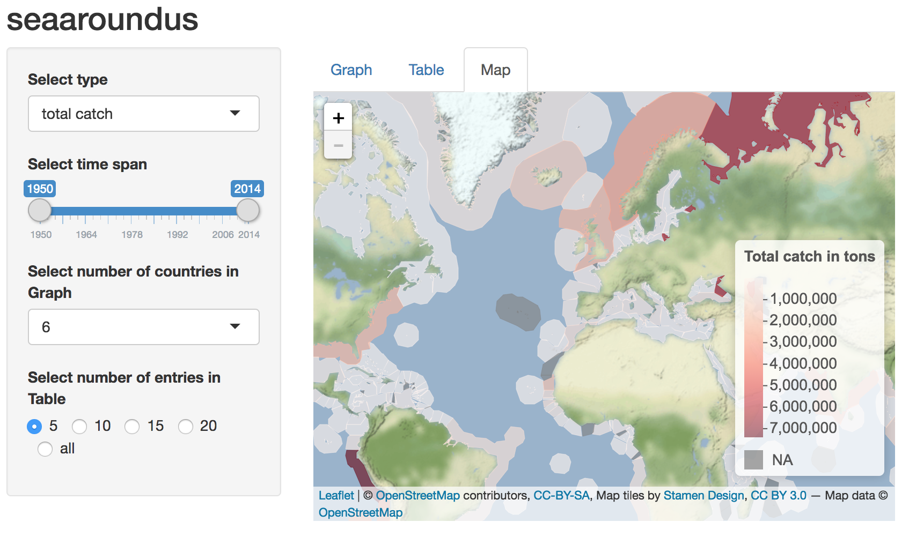

```{r setup, include=FALSE}
knitr::opts_chunk$set(echo = TRUE)
```

# Introduction

The Sea Around Us initiative is a research project by the University of British Columbia, that provides reported an reconstructed catch data for worldwide fisheries and fishery resources. Since overfishing is the major driver on the declining viability of fish stocks, a monitoring program with valid data is crucial for evaluating the marine development. The database thus provides information for policy makers, fishery managers and the scientific community to get a better understanding of global fish catches and more detailed information on which countries are involved. The impact of fishery on the marine ecosystems therefore is presented on a spatial scale in such a way that it has an ecological and political relevance. <cite>(Pauly D. and Zeller D. , 2015. Sea Around Us Concepts, Design and Data<cite> [www.seaaroundus.org](www.seaaroundus.org))

The database covers catch data over 64 years, from 1950 to 2014, classified by various categories such as taxon, fishing sector (industrial, artisanal, subsistence and recreational), catch type (landed and discarded catch), reporting status (reported and unreported) and so forth. The data can be shown for different spatial divisions such as Exclusive-economic zones (EEZ) and large marine ecosystems (LME) or organisational divisions such as regional fisheries management organizations (RFMO) or fishing-entity. Also, the data can be returned either in tonnage (tons) ore monetary value (US$). 
The data can be queried and looked at directly on the website www.seaaroundus.org where it can also be downloaded. For the purpose of a more in depth data work the R library “seaaroundus” is provided containing some functions to accesss the SAU-database. 

The aim of this project is to show worldwide catch data differentiated by country, i.e. the amount of catch each country has taken out of the oceans over time as well as differentiated by exclusive economic zones as a spatial indicator, i.e. how much fish is taken out where in the world. In addition, we want to show the proportion of discards in total catch in order to get an impression of the share of "waste" in worldwide fish takeouts. Moreover, this information shall be displayed for different time periods for the purpose of comparison and a deeper understanding of fish catch development over the past decades. 
In order to get the relevant data from the database we used the provided "seaaroundus"-package in R. For the visualisation of the data we used R Shiny and created an interactive (web) application.


# Materials and Methods

## Data extraction
The seaaroundus-package in R provides 6 functions to access the seaaroundus database and get different information. The main function to get specific catch data is the `catchdata`-function which transfers the input arguments to the database and returns either a data frame or a plot: 
```{r, eval=FALSE}
seaaroundus::catchdata(region, id, measure = "tonnage", dimension = "taxon", limit = 10, chart = FALSE, ...)
```

Input arguments specify the spatial dimension (`region`, `id`) as well as the type of data (`measure`, `dimension`), i.e. how it is quantified and in what categories it is presented. 
Options for `region` are 

* eez (exclusive economic zones)
* lme (lareg marine ecosystems)
* rfmo (regional fisheries management organisations)
* highseas
* fao
* eez-bordering
* fhishing entity
* taxon

The `id` depends on the specified region. A list of ids for each region can be called via the function `listregion(region)`.

Options for `dimension` are

* taxon
* commercialgroup
* functionalgroup
* country
* sector
* catchtype
* reporting-status
* layer

The arguments `limit` and `chart` give the possibilty for some queries to limit the returned data and to return it as a chart instead of a `data.frame`.

The `catchdata`-function does not provide the option to get information for more than one `id` at once. That is why a loop was run on the function passing a vector with all required ids in order to get overall information stored in one `data.frame`. This was done to get information on 

* the total catch for each country (`region="fishing-entity"` and `dimension="country"`)
* the amount of landings and discards for each country (`region="fishing-entity"` and `dimension="catchtype"`)
* the total catch *or* the share of discards within all Exclusive Economic Zones (EEZ) (`region="eez"` and `dimension="catchtype"`)

For all queries `measure` was set to `"tonnage"`. The queried data was put into `data.frames` and saved locally serving as database for the Shiny Web App. Below an exemplary code is shown. The whole code can be found in Appendix A. 

```{r, eval=F, echo=T}
#------------------------------
# Dataframe df_total_catch: Total fish catch in tons for every country and every year
#------------------------------
df_total_catch<- catchdata('fishing-entity', countryids[1], measure='tonnage', dimension='country')

for (i in 2:length(countryids)){ 
  #beginning with 2.column (first one is year)
  #every new column is the time series of total fish catches for one country:
  newcol<- catchdata('fishing-entity', countryids[i], measure='tonnage', dimension='country')
  df_total_catch[countrynames[i]] <-newcol[,2]
}
```

## Visualisation

In order to visualise the queried data _R-Shiny Web App_ was used. This allows an interactive display of the information gathered on global fish catch. In general, the data is shown in a graph as well as in a table to get an overview of the numbers. To get an impression of the spatial distribution a map is displayed, too. All three outputs react to different dynamic input variables which the user is able to modify according to his or her interests. 

The implemented shiny app command consists of two arguments which need to be defined: 
`shinyApp(ui, server)` 
In the first one, the user interface is specified. Here, the layout contains a `sidebarPanel` and a `MainPanel` where input and ouput variables are arranged. The input variables build the interactive part providing a set of choices towards the ouput: three `select`-options and one `slider`-option give the possibility to change 

* the information which shall be displayed (*total catch* or _proportion of discards_)
* the time span for which the information shall be displayed (ranging from 1950 to 2014)
* the number of countries for which the information shall be displayed in the plots (ranging from 1 to 12)
* the number of entries to be listed in the tables (5 choices given)

The `MainPanel` defines the arrangement of the output in Tabs, i.e. showing either the plot *or* the table *or* the map. 
In the second argument of the shiny app the _server_ is defined, being the part which reacts to the varying input variables and which compiles the output. First, two reactive functions, `dataInput` and `calcTable`, return the changing data which are needed to produce the outputs. Then, the outputs (plot, table and map) are created. Therefore, the returned changed input data from `dataInput()` is further processed for the `output$tabGraph` via an `if else` statement and plotting commands using `ggplot()`. The return of the `calcTable`-function gets passed to the `output$tabTable` to create the respective table. In a last step, `output$tabMap`, the map is created via `leaflet` which allows the user to zoom in and out and have a closer look at the different eezs. The map is produced each time `dataInput$data_map` changes. The basis for the map is a shapefile of worldwide EEZs provided by the Marine Regions Geodatabase ([www.marineregions.org](www.marineregions.org)), which is managed by the Flanders Marine Institute. The map produced here uses the version of 2014. Because neither the ids nor the country names correspond completely with the names of the searoundus data, the latter were adjusted manually. After this correction, the EEZ id of the SAU data could be added to the shapefile and be used as a key for merging. The SAU database contains 280 EEZs, while the Marine Regions database has only 249 EEZs. Because some zones within one database are split up into different zones in the other database or are missing, the zones shown in the map are reduced to 205 after the merge. 

The Shiny App is run via the command `shinyApp(ui = ui, server = server)`. The whole code for the Shiny App can be found in Appendix B.

# Results

The seaaroundus-Shiny Web App-R document is attached to the project file "seaaroundus" and can be opened and run via RStudio. In the following, exemplary screenshots are used to describe the outcome. 

The "total catch"-plot shows the development of the total amount of catch per year in tonnage over time as a stacked chart for up to 12 countries which are ordered descendingly by averaged amount of catch. For each chosen number of countries the remaining countries are summarised as "Others", accordingly. The default settings display 6 countries for the whole time period from 1950 to 2014, showing Japan to be the country with the highest average catch during this time span followed by the Russian Federation, Peru, USA, China and Norway (Figure 1). The table output provides the average catch per year and offers to return the data for 5, 10, 15, 20 or all countries, which in total is 197. Here, the default is set to 5 countries. 

{width=100%}

The "discards"-plot shows the development of the share of discards in total catch in percent over time as a line plot. Again, up to 12 countries can be displayed chosen by the rank they occupy when descendingly ordered by average share of discards. Kuwait has the highest amount of discards within the default time span followed by SaintPierre & Miquelon (France), El Salvador, Costa Rica, Portugal and Nicaragua which can be derived from the table (Figure 2).

{width=100%}

The eez-maps display the distribution of worldwide catches within 249 EEZs. The map with default settings for the *total_catch* data shows high catch rates along the coastline of Northern Europe and Russia as well as at USA's atlantic coast and Peru's coast (Figure 3). Moving around within the map in the App will show high fishing rates especially in Southeast Asia.

{width=100%}

# Discussion

## Data extraction

The provided `catchdata`-function in the seaaroundus-package serves well to get differently combined information on global fish catch data. However, there are some limits to the function. For example, the `id` input argument only allows to put in one id leading to strong restrictions concerning ad-hoc information on more than one id within the specified `region` argument. Furthermore, some quite interesting combinations, though listed as possible, do not return any data at all, such as 
`catchdata(region="taxon", id="", measure="tonnage", dimension="country")`. 
For the purpose of a more free handling of the fish catch data and faster processing of required queries, a direct access to the database would have been desirable. However, within the scope of this project, it was not possible to easily work around the provided `catchdata`-function and create, e.g., a direct server connection. Hence, the desired information on catch data for all countries had to be performed via a loop processing huge amount of data locally thus taking up a relatively large amount of time. 

## Visualisation

The visualisation of the queried data via R-Shiny provides interactive features allowing the viewer to define the output, i.e. adjust the data according to one's interests. Within the timeframe of this project, only a glimpse into the manifold possibilites of interactive visualisation provided by the shiny web app could be tested and implemented. There is, most certainly, a more efficient way to process the changing data input and transform it into the wanted output. Moreover, some further possibilities of outputs could be implemented ranging from additional ways to display the current data, adding more choices for the user to modify the data input or extend the content of information, i.e. query more data from the seaaroundus database. For the latter, a way to access the database directly would be preferable if not obligatory. 

The visualisation of catch data among EEZs caused some difficulties resulting in a distorted impression of the spatial distribution. Reasons can be found in a differing resolution and naming of the EEZs within the seaaroundus database and the Marine Regions shapefile. Hence, no readymade explicit key was available to merge the datasets and had to be adjusted manually. Due to the limited time, it was not possible to assign all catch data fully correct or rather summarise higher resoluted EEZs in a reasonable way. 

# Conclusion

To conclude, the seaaroundus database provides comprehensive data on global fish catch serving to answer different ecological, political and economical questions related to worldwide fishing. The data can be queried and downloaded from the website or accessed via the provided R-package "seaaroundus". However, both ways have limitations concerning some data queries. For the purpose of this course, a direct access to the database would have been preferable, making it possible to formulate personalised SQL-queries and shift computing effort which allows for more data processing.
However, the result of this project has to be considered against the background of a limited timeframe where several different materials and methods were taken into account. In any case, the personal perception concerning gain of knowledge and skills for each group member is very high.

# References

Pauly D. and Zeller D. (2015): Sea Around Us Concepts, Design and Data

R Core Team (2017). R: A language and environment for statistical computing. R Foundation for Statistical Computing, Vienna, Austria. URL https://www.R-project.org/.

Scott Chamberlain and Robert Scott Reis (2017). seaaroundus: Sea Around Us API Wrapper. R package version 1.2.0. https://CRAN.R-project.org/package=seaaroundus

Winston Chang, Joe Cheng, JJ Allaire, Yihui Xie and Jonathan McPherson (2017). shiny: Web Application Framework for R. R package version 1.0.5. https://CRAN.R-project.org/package=shiny

# Appendix
## A

```{r, eval=F, echo=T}
# CREATING THE DATA FRAMES
#--------------------------
library(seaaroundus)

#data frame with countries and country ids to get catch data from the SAU server:
regiondf <- listregions("fishing-entity")

#Error Messages in:
#Unknown Fishing Country: row 192
#Fishing Country Unknown: row 61
#Johnston Atoll: row 93
# --> take them out 

countrynames <- regiondf$title[-c(61,93,192)]
countryids <- regiondf$id[-c(61,93,192)]

#------------------------------
# Dataframe df_total_catch: Total fish catch in tons for every country and every year
#------------------------------
#get a data frame with the total catches of the first country from the SAU server:
df_total_catch<- catchdata('fishing-entity', countryids[1], measure='tonnage', dimension='country')

#loop over all countries:
for (i in 2:length(countryids)){ 
  newcol<- catchdata('fishing-entity', countryids[i], measure='tonnage', dimension='country')
  df_total_catch[countrynames[i]] <-newcol[,2]
}

#write.table(df_total_catch, "df_total_catch", sep="\t") 


#---------------------------
# Dataframe df_discards: Landings and discards of every country and every year 
#----------------------------
# Execute catchdata for all countryids; output as list
list_catchtype <- lapply(X = countryids, FUN = catchdata, region="fishing-entity", measure="tonnage", dimension="catchtype")

# for further processing the data has to be extracted from the list and put into one data.frame: ----

# initial data.frame to be filled with remaining list entries
df_discards <- list_catchtype[[1]]
df_discards$country <- countrynames[1]

# loop to get all entries of list into one data.frame
for (i in 2:length(list_catchtype)){
  
  df_new <- list_catchtype[[i]]
  
  if (ncol(df_new)<3)   # if clause to check for same amount of columns
    df_new$discards <- 0
  
  df_new$country <- countrynames[i]
  
  df_discards <- bind_rows(df_discards, df_new)
}

#---------------------------
# Dataframe df_eez: Landings and discards in every EEZ for every year
#----------------------------
eez <- listregions(region="eez")

#Execute catchdata for every EEZ; output as list:
list_eez <- lapply(X = eez_all, FUN = catchdata, region="eez", measure="tonnage", dimension="catchtype")

# create initial data.frame to be filled with remaining list entries
df_eez <- list_eez[[1]]
df_eez$eez <- eez$title[1]
df_eez$sau_id <- eez$id[1]

#get all entries of list into one data.frame
for (i in 2:length(list_eez)){
  df_new <- list_eez[[i]]
  
  if (ncol(df_new)<3)
    df_new$discards <- 0
  
  df_new$eez <- eez_names[i]
  df_new$id <- eez_all[i]
  
  df_eez <- bind_rows(df_eez, df_new)
}
#write.table(df_eez, "df_eez", sep="\t")

#---------------------------
# Dataframe sau_id: changed the EEZ names of df_eez manually to be equal to the names in the shapefile
#---------------------------
```

## B

```{r, eval=F, echo=T}
library(shiny)
library(ggplot2)
library(tidyverse)
library(sf)
library(leaflet)


#read in data: ----
df_total_catch <- read.delim("df_total_catch")
df_discards <- read.delim("df_discards")
df_eez <-read.delim("df_eez")
sau_id <-read.delim("sau_id")
eez_shp <- st_read("World_EEZ_v8_2014.shp")

#Add the SeeAroundUs EEZ Id to the shapefile: ----
eez_shp_sau <- merge(eez_shp, sau_id, by="Country", all.x=T)

# Define UI for seaaroundus app ----
ui <- fluidPage(
  
  # App title ----
  titlePanel("seaaroundus"),
  
  # Sidebar layout with input and output definitions ----
  sidebarLayout(
    
    # Sidebar panel for inputs ----
    sidebarPanel(
      
      # Input: Select-option for type of information in plots ----
      selectInput(inputId = "type",
                  label = "Select type",
                  choices = c("total catch", "discards")),
      
      # Input: Slider for range of years to be displayed ----
      sliderInput(inputId = "range",
                  label = "Select time span",
                  min = 1950,
                  max = 2014,
                  sep = "",
                  value = c(1950, 2014)),
      
      # Input: Select-option for number of countries to be displayed in plots
      selectInput(inputId = "number",
                  label = "Select number of countries in Graph",
                  choices = c(1:12),
                  selected = 6),
      
      # Input: Select-option for number of entries to be listed in tables
      radioButtons(inputId = "table_len",
                   label = "Select number of entries in Table",
                   inline=T,
                   choiceNames = c("5", "10", "15", "20", "all"),
                   choiceValues = c(5, 10, 15, 20, 197))
    ),
    
    # Main panel for displaying outputs with options ----
    mainPanel(
      
      # Output: Two tab panels: ----
      tabsetPanel(type="tabs",
                  tabPanel("Graph", plotOutput(outputId = "tabPlot")),
                  tabPanel("Table", tableOutput("tabTable")),
                  tabPanel("Map", leafletOutput(outputId = "tabMap"))
      )
    )
  )
)


# Define server logic required to draw plots and show tables ----
server <- function(input, output) {
  
  # First reactive function returning basis for plots and tables (output 1-3)
  dataInput <- reactive({
    
    data <- switch(input$type,
                   "total catch" = df_total_catch,
                   "discards" = df_discards)
    
    range <- input$range
    
    number <- input$number
    
    #Filter the dataframe (total_catch or discards) depending on the selected time range:
    data_plot <- data %>% filter(years>=range[1], years<=range[2])
    
    if(input$type == "total catch"){
      
      #average total catch for every country:
      data_table <- data_plot %>% gather(., key="country", value="tonnage", -c(years)) %>%
        group_by(country) %>% summarise(avg=sum(tonnage))
      
      #average total catch for every EEZ:
      data_map <- df_eez %>%
        filter(years>=range[1], years<=range[2]) %>% group_by(sau_id) %>%
        summarise(avg=mean(landings+discards))
      
      #summarise Russia's EEZs:
      data_map$avg[which(data_map$sau_id == 648)] <-sum(data_map$avg[which(data_map$sau_id %in% c(648,645,647,649,912,913))])
      
      #summarise USA's EEZs
      data_map$avg[which(data_map$sau_id == 953)] <-sum(data_map$avg[which(data_map$sau_id %in% c(953,954,956))])
      
      #title for EEZ-map
      title_map <- "Total catch in tons"
    }
    else { 
      
      #average percentage of discards for every country:
      data_table <- data %>%
        mutate(perc_disc = (discards/(landings+discards))*100) %>% 
        group_by(country) %>% summarise(avg=mean(perc_disc))
      
      #average percentage of discards for every EEZ:
      data_map <- df_eez %>%
        filter(years>=range[1], years<=range[2]) %>% group_by(sau_id) %>%
        summarise(avg=mean(discards/(landings+discards))*100)
      
      #summarise Russia's EEZs:
      data_map$avg[which(data_map$sau_id == 648)] <-mean(data_map$avg[which(data_map$sau_id %in% c(648,645,647,649,912,913))])
      
      #summarise USA's EEZs:
      data_map$avg[which(data_map$sau_id == 953)] <-mean(data_map$avg[which(data_map$sau_id %in% c(953,954,956))])
      
      #title for EEZ-map
      title_map <- "Discards in %"
    }
    
    return(list("data_plot"=data_plot, "data_table"=data_table, "data_map"=data_map,
                "number"=number, "title_map"=title_map))
  })
  
  # Second reactive expression returning values for tables (output 2) ----
  calcTable <- reactive({
    
    data_table <- dataInput()$data_table
    
    #sorting the tables by average values (from highest to lowest), take only the selected table length:
    
    if(input$type=="total catch"){
      data_table <- arrange(data_table, desc(avg))[c(1:input$table_len),]
      colnames(data_table) <- c("country", "average catch per year in tons")
    }
    else{
      data_table <- arrange(data_table, desc(avg))[c(1:input$table_len),]
      colnames(data_table) <- c("country", "average share of discards in total catch per year in %")
    }
    
    return(data_table)
  })
  
  
  # Output 1: Plots ----
  output$tabPlot <- renderPlot({
    
    data <- dataInput()$data_plot
    number <- as.integer(dataInput()$number) #the number of countries shown in the graph 
    
    # - prepare the data frames for ggplot, summarise the countries with lower averages to "others"
    # - plot as stacked plot
    
    if (input$type == "total catch"){
      
      data <- data %>% gather(., key="country", value="tonnage", -c(years)) 
      
      data_arranged <- data %>% group_by(country) %>% summarise(avg=mean(tonnage)) %>% arrange(., desc(avg))
      
      data_high <- data %>% filter(country %in% data_arranged[c(1:number),]$country)
      data_low <- data %>% filter(country %in% data_arranged[c((number +1):nrow(data)),]$country)  %>% group_by(years) %>%
        summarise(tonnage = sum(tonnage)) %>% mutate(country = "Others") %>%
        select(years,country,tonnage)
      
      
      data <- bind_rows(data_high, data_low)
      
      ggplot(data=data, aes(x= years, y=tonnage))+
        geom_area(aes(fill=factor(country, levels=c(data_arranged[c(1:number),]$country, "Others"))))+
        theme(legend.position = "right")+
        guides(fill=guide_legend(title="countries"))+
        labs(title = "Total catch grouped by country (ordered descendingly by average)")
    }
    else {
      data <- data %>%
        mutate(perc_disc = (discards/(landings+discards))*100)
      data1 <- data %>%
        group_by(country) %>%
        summarise(avg=mean(perc_disc)) %>%
        arrange(., desc(avg)) %>% 
        top_n(., n=number)
      
      data_high <- data %>% filter(country %in% data1$country)
      
      ggplot(data=data_high, aes(x=years, y=perc_disc, colour=country))+
        geom_line(size=1.3)+
        theme(legend.position = "right")+
        labs(title = "Share of discards in total catch (grouped by country, ordered descendingly by average)", y = "percentage")
    }
  })
  
  # Output 2: Table ----
  output$tabTable <- renderTable({
    calcTable()
  })
  
  # Output 3: Map ----
  output$tabMap <- renderLeaflet({
    
    data_map <- dataInput()$data_map
    title_map <- dataInput()$title_map

    #merge the average values (total catch or percentage of discards) and the shapefile:
    eez_merge <- merge(eez_shp_sau, data_map, by="sau_id", all.x=T)
    
    #define color-scale and labels for map
    pal <- colorNumeric("Reds", domain = eez_merge$avg)
    labels <- sprintf(
      "<strong>%s</strong><br/>%g",
      eez_merge$EEZ, eez_merge$avg) %>% lapply(htmltools::HTML)
    
    #create interactive map with leaflet
    leaflet(options = leafletOptions(minZoom = 2, maxZoom = 10)) %>% 
      addTiles() %>% 
      setView(lng = 0, lat = 40, zoom = 2) %>% 
      addProviderTiles("Stamen.TerrainBackground") %>%
      addPolygons(data=eez_merge, stroke = TRUE, color = ~pal(eez_merge$avg),
                  fillOpacity = 0.6, smoothFactor = 1, weight = 0.5,  
                  highlightOptions = highlightOptions(color = "black", weight = 2, bringToFront = TRUE),
                  label = labels) %>% 
      addLegend("bottomright", pal=pal, values= eez_merge$avg, title = title_map)
  })
}

# Create Shiny app ----
shinyApp(ui = ui, server = server)

```

